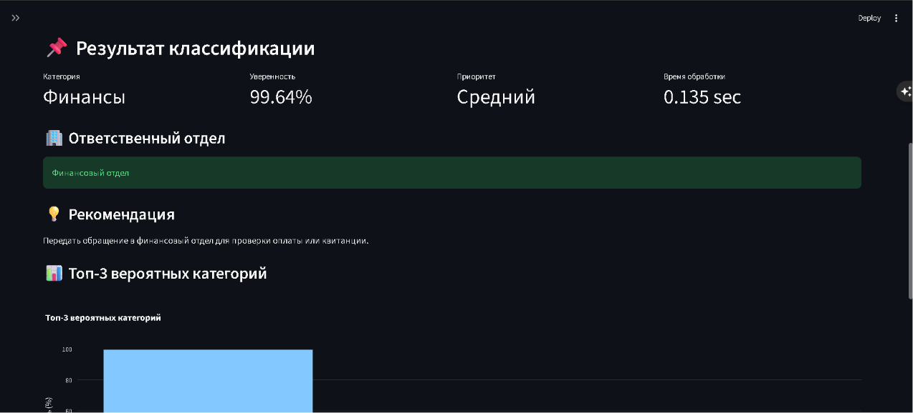

# Student Request Classifier

[](https://github.com/AhmedHagag1/student-request-classifier/actions/workflows/repository-checks.yml)

Graduation project by Ahmed Haggag: a bilingual Streamlit application that classifies student requests into nine categories using multilingual DistilBERT.

**Status:** educational prototype. The source has been reviewed for portfolio preparation; full application execution has not been verified in this review environment.



## Features

- Russian and English interfaces and request classification.
- Top three category predictions and model scores.
- Department and recommendation lookup based on the predicted category.
- Rule-based priority using keywords and a confidence threshold; priority is not a separately trained model.
- TF-IDF baselines: Logistic Regression, Linear SVM and Naive Bayes.

## Stack

Python, Streamlit, PyTorch, Transformers, scikit-learn, pandas, Plotly and Matplotlib.

## Local setup

Run these commands from the project root. A compatible Python environment is required; the original Python version was not recorded and the supplied dependency pins have not been installation-tested during this review.

```bash
python -m venv .venv
```

Activate with `.venv\Scripts\activate` on Windows Command Prompt or `source .venv/bin/activate` on Linux/macOS, then:

```bash
python -m pip install -r requirements.txt
python -m streamlit run app.py
```

**Before launching:** copy `model/final_model/model.safetensors` from the original submission archive into the same location here. The approximately 541 MB weight file is deliberately excluded from this source archive. The tokenizer and model configuration are included. No public model download has been published; cloning source alone is insufficient to launch inference.

Alternatively, train the model with internet access to obtain the base model, sufficient RAM, and preferably a suitable GPU:

```bash
python -m src.train_baselines
python -m src.train_bert
python -m src.evaluate
```

Training is optional when the original weights are available. These scripts overwrite report files; run them in a working copy. The baseline script replaces the comparison CSV, so run it before the transformer training script if generating both sets of results.

## Repository checks

The lightweight CI check uses only Python's standard library. It validates the expected dataset columns, row counts, label/language sets, uniqueness of the small test set, and the presence of essential portfolio files:

```bash
python -m unittest discover -s tests -p "test_*.py"
```

This check protects repository structure and data contracts; it does not reproduce model training or the reported metrics.

## Data and results: limitations

The supplied dataset contains 6,075 rows: 2,700 Russian, 2,700 English and 675 mixed-language rows. Each of the nine categories has 675 rows. Data generation code is included. The separate file named `real_test.csv` contains 54 examples (27 RU and 27 EN); its filename does not establish that these are independently collected real-world requests.

| Model | Reported held-out accuracy | Reported 54-example accuracy |
| --- | ---: | ---: |
| TF-IDF + Logistic Regression | 99.59% | 98.15% |
| TF-IDF + Linear SVM | 99.59% | 98.15% |
| TF-IDF + Naive Bayes | 98.68% | 98.15% |
| Multilingual DistilBERT | 99.26% | 98.15% |

These are **historical results supplied with the project**, not independently reproduced scores. Review identified substantial overlap:

- Only 3,625 unique texts remain after trimming and lowercasing the 6,075 rows.
- Reproducing the configured split (`test_size=0.2`, `random_state=42`, stratified labels) finds that 599 of 1,215 test rows have normalized text also present in training.
- Three of the 54 separate test texts also occur in the training split.
- `src.evaluate` evaluates all of `dataset.csv`, including training rows. Its reported 99.84% is not held-out accuracy.

Consequently these numbers are not reliable evidence of real-world generalization. The current comparison also does not demonstrate that DistilBERT outperforms the simpler baselines. A next evaluation should deduplicate/group related templates before splitting, use a fresh independent test set, and retrain before reporting new scores.

## Architecture

`app.py` calls `src/inference.py`, which loads the local tokenizer/model and returns category scores. `src/labels.py` supplies label translations, departments, recommendations and priority keywords.

- `data/`: supplied dataset and small test set.
- `src/`: generator, training, inference and evaluation code.
- `reports/`: original saved metrics and plots, preserved unchanged.
- `docs/`: original thesis notes, diagrams and screenshots. Historical claims should be read alongside the review limitations above.
- `model/final_model/`: tokenizer/configuration; weights must be restored separately.

## Review and scope

See [preparation review](docs/preparation_review.md). This package does not change the trained model, dataset, application behavior or historical metrics. No production deployment or independent institutional integration is claimed. Softmax scores are not calibrated guarantees of correctness. Confirm rights and provenance of data and upstream model assets before redistribution; no new license has been assigned in this preparation.
